# Roger Assignment

## Setup Instructions

1. Clone the repository:

```bash
git clone git@github.com:dibkb/roger-assignment.git
cd roger-assignment
```

2. Environment Configuration:

```bash
cp .env.example .env
```

Edit the `.env` file and populate the required values.

3. Install Dependencies:

```bash
pnpm install
```

## Running the Application

To start the development server:

```bash
pnpm run dev
```

The application will be running on port 3000.

## Testing

To run the test suite:

```bash
pnpm test
```

## Sample Data

Sample CSV files are available in the `sample-data` directory:

- `data-dup.csv`: Contains sample data with potential duplicates
- `data2.csv`: Additional sample dataset
- `datqa.csv`: Another sample dataset

You can use these files to test the application's functionality.

## Demo Video

A demonstration of the application's features is available here:
[Watch Demo Video](https://www.loom.com/share/21e250bde51c4ee08fc9ecbd7a7adc47?sid=d027e385-82e0-4ab6-8486-43011783a661)

## Live Preview (⚠️ not recommended)

```
https://roger-assignment.vercel.app/
```

## System Design Diagram

```mermaid
graph TD
   A["🎨 Frontend UI<br/>📤 Upload • 📊 Table View • ✨ UX"] --> B["📄 CSV Upload / Drag-Drop<br/>🤖 Parsed & mapped via GPT-4o<br/>📦 Returns: uuid, normalizedData"]
   B --> C["💾 Stored in Zustand Store<br/>🔄 + localStorage for uuid"]
   C --> D["🌐 Go to /csv/uuid"]
   D --> E["📋 Table Display<br/>🎯 Normalized UI"]
   E --> F["🔍 Deduplication Logic<br/>📧 By email/linkedin"]
   F --> G["✅ Unique Deduplicated Entries"]
   G --> H["⚡ Enhance<br/>🔘 Row Btn"]
   G --> I["🚀 Enhance All Btn<br/>⚙️ Uses p-limit(6)<br/>🔗 Calls Enhance Row under hood"]
   I --> J["🤖 Mastra AI Agent<br/>🛠️ Tools: SCRAPIN, SCRAPEOW, SERP API"]
   J --> K["✨ Enhanced Row Data<br/>🔄 Replace in UI"]
   K --> L["📊 Token Usage Count"]
   K --> M["📈 Global Progress"]
   K --> N["❌ Per Row Error Info"]
   M --> O["🔍 Highlight rows<br/>⚠️ missing email / LI"]
   O --> P["⬇️ Download Enhanced<br/>📊 CSV (Filtered)"]

   %% Styling
   classDef primaryNode fill:#4f46e5,stroke:#312e81,stroke-width:2px,color:#fff,font-weight:bold
   classDef processNode fill:#059669,stroke:#064e3b,stroke-width:2px,color:#fff,font-weight:bold
   classDef storageNode fill:#dc2626,stroke:#991b1b,stroke-width:2px,color:#fff,font-weight:bold
   classDef actionNode fill:#ea580c,stroke:#9a3412,stroke-width:2px,color:#fff,font-weight:bold
   classDef outputNode fill:#7c3aed,stroke:#581c87,stroke-width:2px,color:#fff,font-weight:bold

   class A primaryNode
   class B,F,J processNode
   class C,E storageNode
   class D,G,H,I actionNode
   class K,L,M,N,O,P outputNode
```



---

### Architecture Summary

1. **CSV Upload**

   - User uploads CSV via UI.
   - Parsed and normalized using **GPT-4o** (header mapping).

2. **Storage**

   - Parsed data stored in **Zustand** + **localStorage** under a `uuid`.
   - Redirects to `/csv/uuid`.

3. **Deduplication**

   - Rows deduplicated by `email` or `linkedin_url`.

4. **Enhancement Options**

   - **Enhance All** → runs row enhancement using `p-limit(6)`.
   - **Enhance Row** → can be triggered individually.

5. **Mastra AI Agent**

   - No retry logic.
   - Tools available:

     - `SCRAPIN`
     - `SCRAPEOW`
     - `SERP API`

6. **Result Handling**

   - Enhanced rows replace originals in UI.
   - Tracks:

     - ✅ Token usage
     - ✅ Progress bar
     - ⚠️ Error info per row

7. **Download**

   - User can download filtered, enhanced CSV.
   - Highlights incomplete rows (missing key fields).
